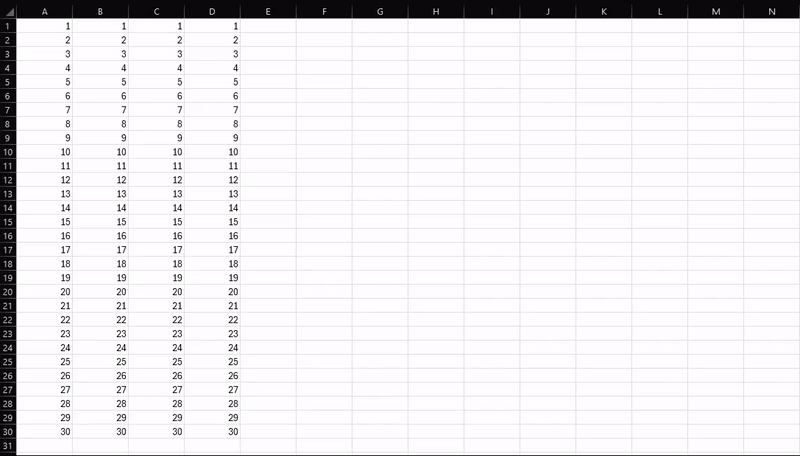

# Excel-lent-FZF
Excel-lent FZF is a fuzzy finder tool for quickly locating and executing Excel macros. Enhance your productivity with fast, intuitive, and efficient fuzzy searching directly within Excel.

## Demo

## Features

- **Dynamic Macro Listing:** Automatically lists all available macros in the workbook and personal.xlsb workbook.
- **Real-Time Filtering:** Provides real-time filtering of macros as you type in the search box.
- **User-Friendly Interface:** Easy-to-use form with ComboBox and ListBox controls for selecting macros.

## Installation

### Prerequisites

- Microsoft Excel
- Basic knowledge of VBA (Visual Basic for Applications)
- Microsoft Visual Basic for Applications Extensibility 5.3 references

### Steps

1. **Open Excel:**
   - Open your personal.xlsb Excel workbook.

2. **Access VBA Editor:**
   - Press `Alt + F11` to open the VBA editor.

3. **Import .FRM and .FRX Files:**
   - Import the `ExcellentFZF.frm` and `ExcellentFZF.frx` files into your VBA project.
   - To do this, right-click on the `Forms` folder in the VBA editor, select `Import File`, and choose the `.frm` file. The associated `.frx` file will be imported automatically.

4. **Import Excel-lent-FZF Module:**
   - Import the ShowExcellentFZF module into your VBA project.
   - To do this, right-click on the `Modules` folder in the VBA editor, select `Import File`, and choose the `.bas`file.

5. **Add Code Modules:**
   - Ensure that you have "Microsoft Visual Basic for Applications Extensibility 5.3" checked in the tools -> references window, if not enable it.

   

### Usage

1. **Open the Form:**
   - To open the Fuzzy Finder form, run the `ShowExcellentFZF` macro. You can either run the macro by hand or press**`Ctrl` + `Shift` + `M`**

2. **Search for Macros:**
   - Type the name of the macro you are looking for in the ComboBox. The list will filter in real-time to match your input.

3. **Select and Run Macro:**
   - Select the desired macro from the filtered list and execute it. You can navigate through the list of suggestion using `tab` the selected macro will be put in the second ListBox. 

4. **Close the Form:**
   - If you mistakenly opened the fuzzy finder you can close it using the `escape` key.

## Contributing

If you would like to contribute to this project, please fork the repository and submit a pull request with your improvements.

## License

This project is licensed under the MIT License - see the LICENSE.md file for details.
